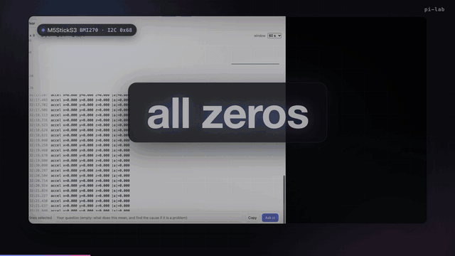

# pi-lab

English · [中文](README.zh.md)

**You and the coding agent watch the same serial port.** Select a few log lines and ask; it fixes the firmware on the real board and shows you.



*Real board, real agent, nothing staged. The accelerometer reads all zeros. Five log lines go to the agent; it reads Bosch's BMI270 datasheet (with page numbers), flashes to reproduce, adds a few register reads, finds two bugs that look fine in the code, flashes again, and the plot returns to 1 g. [Full video with narration](https://github.com/woertedetiankong/pi-lab/releases) · the recording is reproducible with `demo/record.mjs`.*

pi-lab is an extension for the [pi](https://pi.dev/) coding agent. Besides the shared panel it gives the agent board tools that do not fight over the serial port, decodes crashes into the log, keeps it out of your toolchain, and keeps a debug ledger that survives a long session.

> Early release (v0.4.0). Tested on an ESP32-S3 (M5StickS3) on macOS. The board tools work with ESP-IDF and PlatformIO projects; automatic USB recovery is macOS only.

## Quick start

Requires Node.js 22.19+ and pi 0.87 or newer.

```bash
pi install git:github.com/woertedetiankong/pi-lab
```

Restart pi in your firmware project and type `/lab web`: the board panel opens in your browser with the board's serial output. Select a few log lines, type a question and press **Ask pi**. Or just ask pi to fix something: it flashes with `board_flash` and checks the result with `board_serial`.

Other ways to install: `pi install git:github.com/woertedetiankong/pi-lab -l` for the current project only (`.pi/settings.json`), or `pi -e git:github.com/woertedetiankong/pi-lab` to try it for one run. Update with `pi update --extensions`; remove with `pi remove git:github.com/woertedetiankong/pi-lab`. From a local checkout: `pi install /path/to/pi-lab`.

## What it is, and what it is not

pi-lab is the screen you share with the agent, and the memory it keeps while debugging. It is not another build server and not a debug probe:

- **Build and flash.** ESP-IDF 6.0 ships its own MCP server (`idf.py mcp-server`: set target, build, flash, clean). pi-lab's `board_flash` covers the same ground for ESP-IDF and PlatformIO projects today, plus the wait-and-reset after flashing and the USB recovery. If the official server fits your workflow, use it; the panel, the ledger and the guard still apply.
- **Debug probes.** [embedded-debugger-mcp](https://github.com/Adancurusul/embedded-debugger-mcp) gives the agent a probe over probe-rs or OpenOCD: halt, memory, breakpoints, RTT, fault registers. pi-lab has no probe support and is not going to compete there; it reads what the firmware prints, and decodes it.
- **Only here:** the panel both of you look at (plots, select the lines, ask), a serial hub that lends the port to flashing and to the agent's own commands instead of "port busy", crash backtraces decoded into the log, a guard for the toolchain, the stale-firmware check, the debug ledger, board packs that say where each fact came from, and a hardware-in-the-loop benchmark with published results. And on top of them: controlled experiments on the board, notes that carry their experiment so anyone can re-run them, and acceptance checks that decide when a fix is done. These also work from Claude Code, Codex and other agents, through pi-lab's MCP server.

## Everything it does

1. **Board tools**, so the agent does not have to work out the serial port and resets on its own.
   - `board_flash`: recognizes ESP-IDF and PlatformIO projects, sets up the toolchain environment, builds and flashes. A failed build returns just the compiler errors. After flashing it waits for the USB port to settle, then resets the board so the new firmware runs. If the USB port stops answering, it recovers it and tries again.
   - `board_serial`: resets the board and captures the serial output from the first boot line, for a number of seconds or until a line matches `until` (instead of `idf.py monitor`, which never exits). Long logs are folded, with the full log saved to a file. The port is opened by lowering RTS before DTR, so opening it does not reset an ESP32's native USB serial port.
   - `board_recover`: when the board's USB port stops answering, a software unplug and replug (USB re-enumeration, macOS).
2. **Board panel (web)**: `/lab web` opens it at `/lab/`, on the same local page as pi-kb and pi-sessions.
   - Live serial log: timestamps, ESP-IDF log levels in colour, a filter. Resets and flashes show as separators.
   - **Plot**: `name=value` pairs in the log (`fps=50`, `temp: 21.5`, `|a|=0.997`) are plotted automatically. Addresses and clock settings printed at start-up are left out, and values printed only once or twice are hidden until you turn them on. Click a point to jump to its log line.
   - **Ask pi**: press on the log and it stops scrolling; drag over lines to select them (click for one line, Shift-click for a range, Cmd/Ctrl-click to add, Cmd/Ctrl+C to copy). Type a question and press **Ask pi**: the lines go to the agent in your terminal with their times, queued after its current turn if it is busy. **Latest** resumes following the log.
   - **Port and baud rate**: choose the port (auto: the most recently connected board) and the baud rate (9600 to 2000000), saved per project in `.pi/lab.json`. A chosen port that is not connected falls back to auto. When most of what arrives is unreadable, the panel says the baud rate probably does not match and offers common rates. The native USB on the ESP32-S3/C3 ignores the baud rate.
   - **Board pack**: choose the project's board and see what pi knows about it: chip, buses and the devices on them, pins, buttons, known quirks, each marked measured on the board or taken from the vendor's docs; read the verified notes and open the datasheets. When the connected device matches a pack, the panel suggests it.
   - Reset the board, recover the USB port, and **release the port** for your own tools or IDE (click again to take it back).
   - pi-lab owns the serial port through one serial hub shared by the panel, `board_serial` and `board_flash`. It lends the port to flashing and to bash commands that open it (a flash, `idf.py monitor`, esptool, a script of the agent's own), so neither you nor the agent meets "port busy". When no panel is watching and no tool is reading, the port is released.
3. **Crash decoding**: when the log shows an ESP-IDF `Backtrace:`, `abort() was called at PC …` or the PC of a register dump, the addresses are turned into functions and source lines with the ELF in the project's `build/` and addr2line (`↳ store_sample at main/main.c:14`). The decoded lines go into the log, are highlighted in the panel, and are part of what `board_serial` returns to the agent.
4. **Guard**: checked before each tool call.
   - Writing into an SDK, toolchain or system directory (`~/.espressif`, `$IDF_PATH`, `~/.platformio`, `/opt/homebrew`, …), `pip install` into a shared Python environment, `sudo` and `brew install` need your confirmation. Without a UI (`pi -p`) they are blocked, and the agent is told how to do it inside the project instead (copy the component into the project, use a virtual environment in the project).
   - Operations that change a chip permanently, such as burning eFuses, secure boot or flash encryption keys and read protection, are flagged as hardware risks.
   - `PI_LAB_GUARD=off` turns it off.
5. **Debug ledger, when the problem resists**: with `lab_ledger` the agent records the target board, what the hardware showed and its hypotheses. The ledger goes into the system prompt every turn and survives context compaction.
   - pi-lab starts **light**: no ledger bookkeeping, because a bug the agent can find by trying things on the board needs none (in the bench, the bookkeeping only added time there). It turns **careful**, and asks for the ledger's rules from that turn on, when the task resists: a second flash in the same task, an experiment whose runs disagree, 20 tool calls without an answer, or the agent starting the ledger itself. `/lab careful` and `/lab light` switch by hand; `"process": "careful"` in `.pi/lab.json` makes a project careful from the start. The mode follows the session's branches.
   - Something newly recorded is a single observation: listed apart, with a note not to build on it. It becomes a fact once reproduced: a settled `board_experiment` counts and is recorded for you; otherwise `verify_fact` after repeating it (for firmware, from a clean build with one change; for host-side scripts, the same run again). Facts are reproduced before building on them, not re-verified after the fix is done.
   - Marking a hypothesis ruled out or confirmed needs evidence; a new hypothesis similar to one already ruled out is refused (in English and Chinese).
   - After 30 tool calls without a reproduced fact or a settled hypothesis, the agent is asked once to step back: restate the original symptom and read the relevant code again from the start.
   - The ledger follows the session's branches.
6. **Firmware sync**: after a successful flash, pi-lab fingerprints the firmware sources (git HEAD, changes, untracked files). As soon as a firmware file changes, the status bar shows `⚠ board runs stale firmware`, and the agent sees it too. When the agent changed firmware but is about to stop without flashing, it is reminded once. Needs the project to be a git repository.
7. **Log folding**: of the build, flash and serial logs sent to the model, only the latest two stay whole; older ones keep their start, end and lines that look like failures. The session file keeps every log in full.
8. **Board packs**: what is known about a board, in `boards/<board>/`.
   - `board.json`: chip, I2C buses and their devices, pins, button behaviour, known quirks, datasheets. Every entry says where it came from: measured on the board, or the vendor's docs or driver library.
   - `notes/`: lessons verified on the board, in pi-kb's note format.
   - `/lab board <id>`, or **Board pack** in the panel, chooses the board for a project (saved in `.pi/lab.json`); when a matching USB device is connected and no board is chosen, pi-lab suggests it. The chosen board's pins, buses and quirks go into the prompt, and its datasheets are downloaded once to `~/.pi/agent/pi-lab/boards/<id>/docs/`.
   - With [pi-kb](https://github.com/woertedetiankong/pi-kb) installed, the datasheets and notes are imported into a collection named after the board, and the agent cites them with page numbers. Without it, the agent reads the files directly.
   - Available now: `m5sticks3` (the M5StickS3: internal I2C, BMI270, M5PM1, and four notes: the port-open reset, USB wedges, the side button's download mode, the BMI270 init sequence).
9. **Experiments** (`board_experiment`): when a result surprises the agent, or two explanations fit, it tests them as a controlled experiment instead of a one-off probe script. Each variant (a command: a script that opens the port one way, a variant build, ...) runs several times in shuffled order, the board is reset before every run, and every run is judged by the same rule: a regular expression on the command's output or on what the board printed afterwards, plus an optional number per run. The result is a table, saved in `.pi/lab/experiments/E<n>.json` with where it ran:

   | Variant | `rst:0x\|ESP-ROM:` | first `t=` (ms since boot) | Consistent |
   | --- | --- | --- | --- |
   | DTR and RTS low before open() | 3/3 | 16 | yes |
   | pyserial defaults | 0/3 | 8207 | yes |
   | both high, then RTS low before DTR | 0/3 | 8207 | yes |

   Commands get the port to themselves and `PI_LAB_PORT`, `PI_LAB_BAUD` and `PI_LAB_PYTHON` (a Python with pyserial). A table where every variant answered the same way in every run goes into the debug ledger as a reproduced fact; one that did not turns pi-lab careful.
10. **Notes that re-run themselves** (`lab_note`): a settled experiment becomes a note in `.pi/lab/notes/`, in pi-kb's format. The measured table is the note's facts; the agent's explanation is kept apart and marked as not measured (in the bench, agents without a note fixed the bug but named the wrong cause two times in three). The experiment travels with the note, so `board_experiment` with `rerun` set to the note runs it again, on another board or after an SDK update, and says whether it still holds; a project note that no longer holds is marked `status: needs-review` with the new table under "Re-runs". The M5StickS3's port-open note carries its experiment.
11. **Board checks** (`board_check`, `/lab check`): the project's acceptance criteria, agreed with the engineer and kept in `.pi/lab.json`: lines that must appear (`expect`), must not (`forbid`), no restart while watched (`noRestart`), a number that stays in range and keeps changing (`metric`). With `"checkAfterFlash": true` they run after every `board_flash`, so a fix is judged by them:

   ```
   [PASS] the logger starts
   [PASS] uptime keeps rising, readings plausible
   [FAIL] no restart in 3 minutes
          FAIL no restart: the board booted 1 more time(s) while watched
   ```
12. **Logic analyzer** (`board_logic`): what the serial log cannot show, through [sigrok-cli](https://sigrok.org/wiki/Sigrok-cli) and any analyzer it supports (the cheap fx2lafw boards, Saleae, DSLogic). With a protocol decoder (`i2c:scl=D0:sda=D1`, `uart:rx=D2:baudrate=115200`, ...) it returns the decoded traffic and counts by kind; without one, per channel how much it is high, its edges and frequency. Set the analyzer in `.pi/lab.json`: `{"logic": {"driver": "fx2lafw", "names": {"D0": "SCL", "D1": "SDA"}}}`.

## Use it from Claude Code, Codex and other agents

pi-lab's board tools are also an MCP server: `board_serial`, `board_flash`, `board_recover`, `board_experiment`, `lab_note`, `board_check` and `board_logic`, the same code as in pi. The project is the directory the agent starts the server in (or `PI_LAB_PROJECT`).

```bash
claude mcp add pi-lab -- node /path/to/pi-lab/src/mcp.ts       # Claude Code
codex mcp add pi-lab -- node /path/to/pi-lab/src/mcp.ts        # Codex
```

Needs Node.js 22.19+ (it runs the TypeScript directly) and a clone of this repository. What needs pi's extension API stays in pi: the board panel, the toolchain guard, the debug ledger and its modes, firmware sync and log folding.

## Commands

| Command | What it does |
| --- | --- |
| `/lab web` | Open the board panel in the browser (`/lab web url` prints the address, `/lab web stop` stops the page server) |
| `/lab serial [port \| auto \| baud]` | Show or set this project's serial port and baud rate, e.g. `/lab serial 9600`, `/lab serial auto` |
| `/lab` | Show the debug ledger and the firmware sync state |
| `/lab target <text>` | Set the target board, e.g. `/lab target STM32F407 on /dev/ttyUSB0` |
| `/lab flashed` | Mark the board as up to date after flashing outside pi (an IDE, a GUI flasher) |
| `/lab clear` | Clear the ledger on the current branch |
| `/lab board [id \| none]` | Show or choose the board pack for this project |
| `/lab careful` / `/lab light` | Ask for the debug ledger's rules now, or go back to light (see "Debug ledger") |
| `/lab check [name]` | Run the project's board checks, or one of them |

Firmware sync needs the project to be a git repository; elsewhere that part is off. In a git project, the status bar shows `🔌` once pi-lab is loaded.

## Known issues

- The ESP32-S3's native USB occasionally wedges as the app takes over the USB port at start-up (the log stops at the bootloader's `Disabling RNG early entropy source...`). After a reset, pi-lab detects this, re-enumerates the USB port and resets once more; otherwise use **Recover USB** in the panel or `board_recover`.

## Benchmark

`bench/` holds debugging tasks run on a real M5StickS3: six ESP-IDF projects with planted bugs; after the agent is done, a script flashes its code and judges the board's output. See [bench/README.md](bench/README.md). Results so far (deepseek-flash):

- Plain pi and pi-lab fixed all six scenarios, and **pi-lab did not make the agent faster**. The ledger-only version was slower in all six, and once took two misobserved "facts" for real and spent 30 minutes on the wrong theory (hence the single-observation rule). The current version, in projects that only name the board, was faster in two scenarios and slower in four.
- In projects that only name the board, plain pi spent about 10 minutes working out serial resets in 1 of 12 runs, and tried to change the machine outside the project in 3 (probing `sudo` twice, installing into the shared Python once). pi-lab: 0 of 12.

The demo video is recorded with `demo/record.mjs`: the real board, the real agent and Bosch's datasheet, nothing staged. See [demo/README.md](demo/README.md) (in Chinese).

## Development

```bash
npm install
npm run check   # tsc
npm test        # node --test
```

## License

MIT
