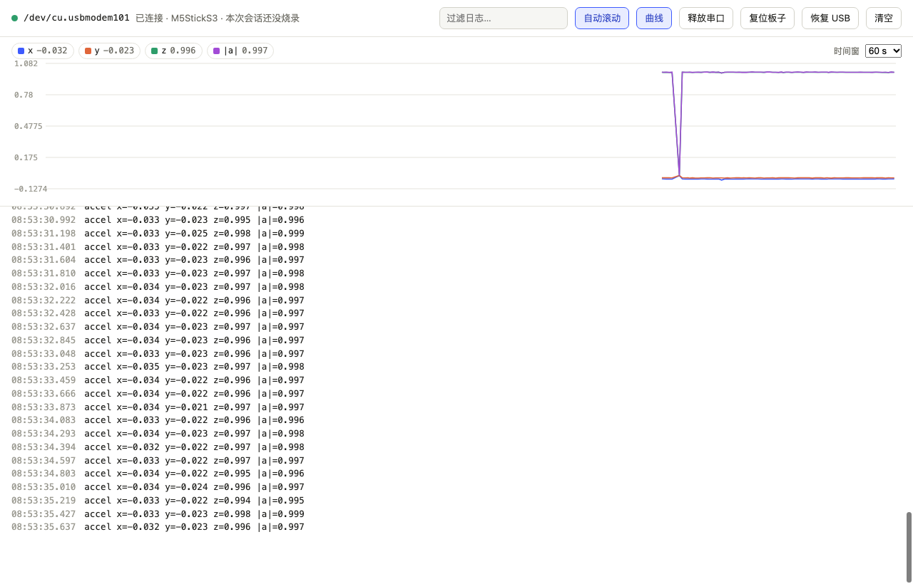

# pi-lab

[English](README.md) · 中文

给 [pi](https://pi.dev/) 用的嵌入式调试插件：让 agent 可靠地烧录和读取开发板，不改动项目以外的工具链，并在长时间调试中记住试过什么。

> 早期版本（v0.3.3）。目前在 ESP32-S3（M5StickS3）上实测；板级工具支持 ESP-IDF 和 PlatformIO 项目，USB 自动恢复仅支持 macOS。



## 功能

1. **板级工具**：agent 不用自己摸索串口和复位。
   - `board_flash`：识别 ESP-IDF / PlatformIO 项目，自动加载工具链环境，编译并烧录；编译失败只返回编译错误；烧录后等 USB 稳定再复位，让新固件运行。USB 无响应时自动恢复并重试。
   - `board_serial`：复位板子，从第一行启动日志开始抓串口，抓够秒数或匹配到 `until` 就结束（代替永不退出的 `idf.py monitor`）。长日志自动折叠，完整日志存到文件。打开串口时先拉低 RTS 再拉低 DTR，避免 ESP32 原生 USB 串口在打开时被误复位。
   - `board_recover`：板子 USB 无响应时，用软件让 USB 重新枚举（相当于拔插一次，macOS）。
2. **板子面板（网页）**：`/lab web` 打开，和 pi-kb、pi-sessions 的网页在同一个地址下（`/lab/`）。
   - 实时串口日志：时间戳、按 ESP-IDF 日志级别着色、过滤；复位、烧录在日志里显示为分隔线。
   - **曲线**：日志里的 `名称=数值`（`fps=50`、`temp: 21.5`、`|a|=0.997`）自动画成曲线；启动阶段的地址、时钟等参数不画；只出现一两次的值默认隐藏。点曲线上的点跳到对应的日志行。
   - **问 pi**：在日志上按下鼠标，日志停止滚动；按住拖过几行就选中它们（单击选一行，Shift 点击选一段，⌘/Ctrl 点击加选，⌘C 复制）。写个问题，点「问 pi」，这几行和时间一起发给终端里的 agent；agent 正忙时排在当前任务之后。「↓ 回到最新」恢复自动滚动。
   - **串口和波特率**：顶部选择看哪个串口（默认「自动」：最近插上的那块板子）和波特率（9600～2000000），按项目保存在 `.pi/lab.json`；指定的串口拔掉后自动回到「自动」。收到的内容大部分是乱码时，提示波特率可能不对，点一下换成常用的波特率。ESP32-S3/C3 的原生 USB 不受波特率影响。
   - 复位板子、恢复 USB、**释放串口**（让你自己的工具或 IDE 用串口，再点一下取回）。
   - pi-lab 通过一个串口中枢独占串口，网页、`board_serial`、`board_flash` 共用：烧录时自动让出、烧完取回；agent 用 bash 跑烧录、`idf.py monitor`、esptool 或自己的串口脚本时，也会先让出串口，不会遇到「端口被占用」。没有网页在看、也没有工具在读时，串口会释放。
3. **崩溃自动解码**：串口里出现 ESP-IDF 的 `Backtrace:`、`abort() was called at PC …` 或寄存器转储的 PC 时，用项目 `build/` 里的 ELF 和 addr2line 翻译成函数和源码行（`↳ store_sample at main/main.c:14`），插在日志里；网页上高亮，`board_serial` 返回给 agent 的结果里也有。

4. **防护**：工具调用执行前检查。
   - 写入 SDK、工具链或系统目录（`~/.espressif`、`$IDF_PATH`、`~/.platformio`、`/opt/homebrew` 等），往共享 Python 环境 `pip install`，`sudo`、`brew install`：需要你确认；没有界面时（`pi -p`）直接拦下，并告诉 agent 怎么在项目内解决（把组件复制进项目、用项目内的虚拟环境）。
   - 烧 eFuse、安全启动/加密密钥、读保护等会永久改变芯片的操作，单独标为硬件风险。
   - `PI_LAB_GUARD=off` 关闭。
5. **调试账本**：agent 用 `lab_ledger` 记录目标板、硬件上观察到的现象和假设，每轮写进系统提示，上下文压缩后不丢失。
   - 新记录的现象先算「单次观察」，单独列出并提示不要以此为基础推理；从干净代码只改一处复现之后，用 `verify_fact` 升级为事实。
   - 假设标为已排除 / 已确认时必须给证据；和已排除的假设相似的新假设会被拦下（中英文都能识别）。
   - 连续 30 次工具调用没有复现的事实、也没有确认或排除假设时，提醒一次「退一步」：回到最初的症状，从头读一遍相关代码。
   - 账本按会话分支保存。
6. **固件同步检测**：烧录成功后记下固件源码的指纹（git HEAD、源码改动、未跟踪文件）。之后固件相关文件一改，状态栏显示 `⚠ board runs stale firmware`，agent 也会看到。agent 改了固件却没烧录就想结束时，提醒一次。需要项目是 git 仓库。
7. **旧日志折叠**：编译、烧录、串口日志在发给模型的上下文里只保留最新两份完整内容，更早的只留开头、结尾和像错误的行。会话文件里仍然保存完整日志。

8. **板卡包**：一块板子的知识打包在 `boards/<板子>/` 里：
   - `board.json`：芯片、I2C 总线和上面的器件、引脚、按键行为、已知的坑、用到的芯片手册。每一项都标明来源：在板子上实测的，或来自厂商文档、驱动库。
   - `notes/`：在板子上验证过的经验笔记（pi-kb 笔记格式）。
   - 用 `/lab board <id>` 给项目选定板子（存在项目的 `.pi/lab.json`）；连着匹配的 USB 设备、又还没选板子时，pi-lab 会提示。选定后，引脚、总线和已知的坑写进提示词；芯片手册下载一次到 `~/.pi/agent/pi-lab/boards/<id>/docs/`。
   - 同时装了 [pi-kb](https://github.com/woertedetiankong/pi-kb) 时，手册和笔记会导入到以板子命名的资料集，agent 检索时带页码引用；没装时，agent 直接读这些文件。
   - 目前有：`m5sticks3`（M5StickS3：内部 I2C、BMI270、M5PM1，以及串口打开即复位、USB 卡死、侧键下载模式、BMI270 初始化四篇笔记）。

## 已知问题

- ESP32-S3 原生 USB 偶尔会在应用启动、接管 USB 时卡住（日志停在 bootloader 的 `Disabling RNG early entropy source...`）。pi-lab 复位后检测到这种情况会自动重新枚举 USB 再复位一次；其他时候用面板上的「恢复 USB」或 `board_recover`。
- 一次测试中，pi 在调用 `board_flash` 前后空等了 10 分钟，没有子进程在运行，原因还没查明（可能是模型请求卡住）。遇到时按 Esc 中断后重试。

## 实测

`bench/` 是在真实 M5StickS3 上的调试测试：6 个埋了 bug 的 ESP-IDF 项目，agent 修完后由脚本烧录并看板子判定。详见 [bench/README.md](bench/README.md)。目前的结论（deepseek-flash）：

- 6 个场景普通 pi 和 pi-lab 都能修好，**pi-lab 没有让 agent 更快**：只有账本的旧版本在 6 个场景里都更慢，还有一次把两条错误观察当成事实，钻了 30 分钟牛角尖（因此有了「单次观察」规则）；新版在只写板子型号的项目里 2 个场景更快、4 个更慢。
- 项目里只写板子型号时，普通 pi 在 12 次里有 1 次花了约 10 分钟摸索串口复位，有 3 次试图改动项目以外的环境（2 次试探 `sudo`，1 次往共享 Python 装包）；pi-lab 12 次里是 0 次。

## 命令

| 命令 | 作用 |
| --- | --- |
| `/lab web` | 在浏览器打开板子面板（`/lab web url` 只显示地址，`/lab web stop` 关闭网页服务） |
| `/lab serial [串口 \| auto \| 波特率]` | 查看或设置这个项目的串口和波特率，例如 `/lab serial 9600`、`/lab serial auto` |
| `/lab` | 查看账本和固件同步状态 |
| `/lab target <描述>` | 设置目标板，例如 `/lab target STM32F407 on /dev/ttyUSB0` |
| `/lab flashed` | 在 pi 之外烧录后（IDE、图形烧录工具），手动标记为已同步 |
| `/lab clear` | 清空当前分支的账本 |
| `/lab board [id \| none]` | 查看或选择这个项目用的板卡包 |

固件同步检测要求项目是 git 仓库；不是 git 仓库时，这部分功能不启用。

## 安装

需要 Node.js 22.19+ 和 pi 0.87 或更新版本。

```bash
# 从 GitHub 安装（写入 ~/.pi/agent/settings.json，所有项目都能用）
pi install git:github.com/woertedetiankong/pi-lab

# 或只装到当前项目（写入 .pi/settings.json）
pi install git:github.com/woertedetiankong/pi-lab -l

# 或不安装，只在这次运行中试用
pi -e git:github.com/woertedetiankong/pi-lab
```

安装后重启 pi，在 git 仓库里的固件项目中，底部状态栏会出现 `🔌`（也可以输入 `/lab` 确认已加载）。更新到最新版本：`pi update --extensions`。卸载：`pi remove git:github.com/woertedetiankong/pi-lab`。

开发者从本地目录安装：`pi install /path/to/pi-lab`。

## 开发

```bash
npm install
npm run check   # tsc
npm test        # node --test
```

## License

MIT
